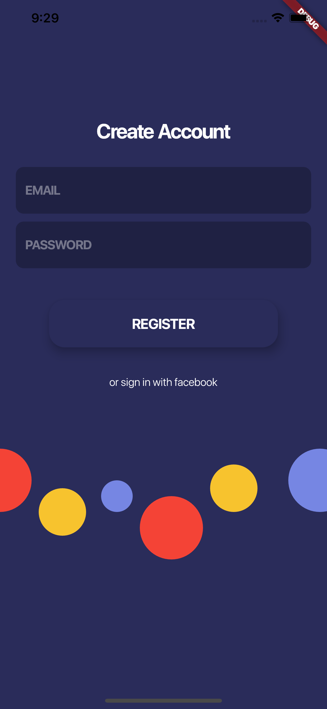
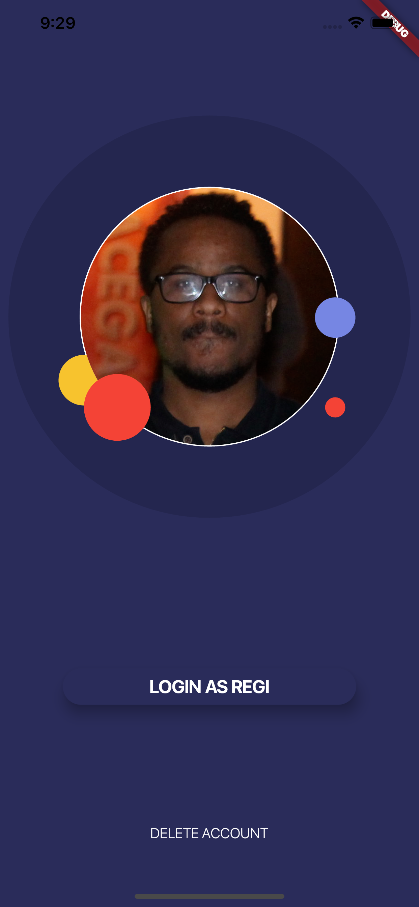

# flutter_ui

Some ui challenges
**UI Challenges build in flutter**
This are a series of ui that I've put together meanwhile practicing flutter;

**Challenge 1.** - this first challenge is inspired by a ui that can be found [here](https://dribbble.com/shots/3691930-Sign-in-and-Sign-up-views-dark-theme). It's a implementation of a login and signup page

 

The full implementation can be found [here](https://github.com/CostaRegi/flutter_ui/tree/feature/challenge_1)

**Challenge 2.** - this is the second challenge is inspired by a ui that can be found [here](https://dribbble.com/shots/3850523-Application-for-Carriers). It's a implementation of a job search, it's important to note that no extra library were used and that all the code was develped using what flutter offers out of the box.

 

The full implementation can be found [here](https://github.com/CostaRegi/flutter_ui/tree/feature/challenge_2)
